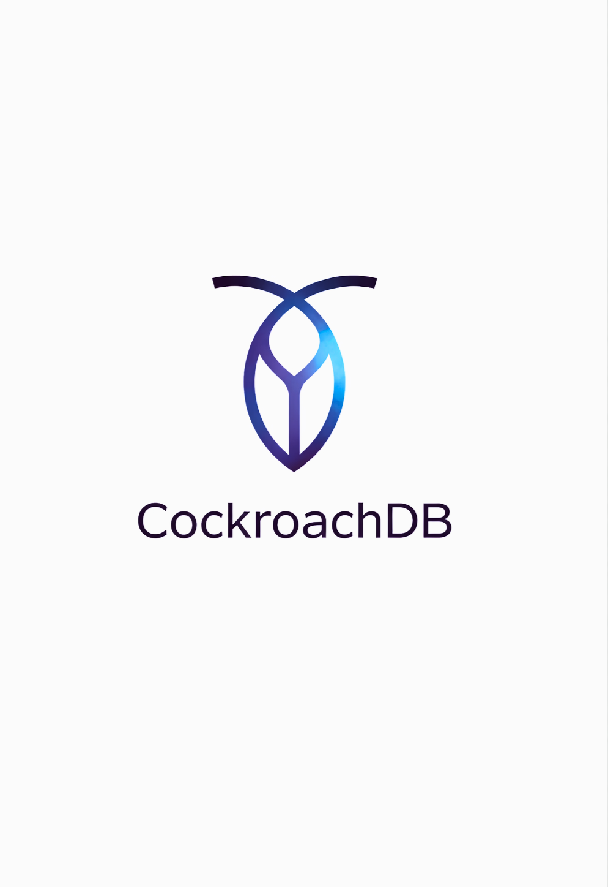

# CockroachDB

## Índice
1. Cockroach DB  
2. ¿Qué es CockroachDB?  
3. Comienzos  
4. Utilidad y características clave  
5. ¿Para qué se usa?  
6. Comparación con Bases de Datos Relacionales Tradicionales  
7. ¿Cómo funciona CockroachDB?  
   7.1 Capas  
8. ¿Qué es lo importante de su funcionamiento?  
9. ¿Por qué es útil este sistema?  
10. ¿Qué tipo de escalado?  
11. ¿Volumen y acceso esperado en Cockroach DB?  
12. ¿Para qué CockroachDB?  
13. ¿Tiene ventajas y desventajas?

---

## 1. Cockroach DB

CockroachDB es un SGBD distribuido, de código abierto, diseñado para la nube y enfocado en la escalabilidad horizontal, alta disponibilidad y resistencia a fallos, ofreciendo una base de datos "siempre activa" con consistencia fuerte y compatibilidad SQL para aplicaciones modernas que necesitan manejar grandes volúmenes de datos distribuidos globalmente sin pérdida de datos, incluso ante fallos de nodos.

---

## 2. ¿Qué es CockroachDB?

CockroachDB es una base de datos relacional distribuida y orientada a la nube. Internamente almacena datos en un almacén clave-valor distribuido, pero expone una interfaz SQL relacional compatible con PostgreSQL. Su diseño prioriza la escalabilidad horizontal, la alta disponibilidad y la consistencia fuerte.

Se autodenomina una "base de datos resistente" (resilient database) por su capacidad de permanecer siempre activa y manejar fallos sin interrupciones.

Combina características de bases de datos relacionales (SQL) con las ventajas de las bases de datos distribuidas (escalabilidad, tolerancia a fallos).

---

## 3. Comienzos

Fue desarrollado por ex-empleados de Google que trabajaron en Spanner, inspirándose en su diseño distribuido para crear una alternativa de código abierto y más accesible.

CockroachDB nació para resolver un problema clave: las bases de datos tradicionales no podían garantizar alta disponibilidad, escalabilidad global y consistencia fuerte al mismo tiempo.

---

## 4. Utilidad y características clave

Alta Disponibilidad y Resiliencia: Replicación automática de datos y tolerancia a fallos, asegurando que la base de datos siga funcionando si un nodo falla ("always-on").

Escalabilidad Horizontal: Se escala añadiendo más nodos al clúster, gestionando el sharding (división de datos) de forma automática.

Consistencia Fuerte: Garantiza que las transacciones sean consistentes en todo el clúster, a diferencia de otras bases de datos distribuidas que sacrifican consistencia por disponibilidad (modelo CAP).

Compatibilidad SQL: Utiliza SQL estándar, facilitando la migración desde bases de datos relacionales tradicionales.

Replicación Geoespacial: Permite replicar datos a través de múltiples ubicaciones geográficas (multi-región, multi-nube) para baja latencia y redundancia.

Soporte JSON: Incluye soporte para datos JSON semiestructurados.

---

## 5. ¿Para qué se usa?

Ideal para aplicaciones que necesitan manejar grandes cantidades de datos distribuidos globalmente, requieren alta disponibilidad y no pueden permitirse tiempo de inactividad, como sistemas financieros, juegos en línea, Internet de las Cosas (IoT) y plataformas de comercio electrónico.

---

## 6. Comparación con Bases de Datos Relacionales Tradicionales

CockroachDB comparte muchas similitudes con bases de datos relacionales como MySQL o PostgreSQL, especialmente en el uso de SQL y el modelo de tablas, filas y columnas. Sin embargo, ha sido diseñada desde el inicio para funcionar de forma distribuida.

Mientras que MySQL o PostgreSQL suelen desplegarse en un único servidor y requieren configuraciones adicionales para lograr alta disponibilidad, CockroachDB gestiona de forma automática la replicación, la tolerancia a fallos y el escalado horizontal.

---

## 7. ¿Cómo funciona CockroachDB?

CockroachDB utiliza una arquitectura distribuida basada en clústeres de nodos, donde cada nodo puede aceptar peticiones y almacenar datos

### 7.1 Capas

Capa externa (SQL):

Tú trabajas con tablas, columnas y consultas SQL estándar.  
Es compatible con PostgreSQL, lo que facilita migraciones y uso de herramientas conocidas.

Capa interna (KV):

Internamente, cada fila de una tabla se transforma en uno o varios pares clave-valor:  
Las claves contienen información sobre la tabla y la fila.  
Los valores almacenan los datos de las columnas.  

Esta capa se distribuye entre múltiples nodos y se replica utilizando el protocolo Raft, garantizando consistencia fuerte incluso ante fallos.

---

## Resumen

Para el desarrollador: CockroachDB es SQL relacional distribuida que funciona igual que un Excel o una base de datos de toda la vida: Tablas, columnas y filas.

Tablas: Son las "hojas" de tu Excel (ejemplo: Clientes).  
Columnas: Son los títulos de arriba (Nombre, Teléfono, Ciudad).  
Filas: Es cada registro de una persona.

Para el sistema: CockroachDB es un almacén clave-valor distribuido sobre el que se construye la capa SQL.

Divide las tablas en fragmentos pequeños.  
Distribuye esos fragmentos entre varios nodos.  
Mantiene múltiples copias de cada fragmento.  

Si un nodo falla, otro toma el control automáticamente sin interrumpir el servicio.

---

## 8. ¿Qué es lo importante de su funcionamiento?

Lo que hace diferente a CockroachDB es cómo guarda esas filas. Imagina que tienes una tabla con 1,000 clientes:

Corta la tabla en trozos: CockroachDB no guarda la tabla entera en una sola computadora. La corta en "pedazos" pequeños (como si fueran tomos de una enciclopedia).

Reparte los trozos: Envía esos pedazos a diferentes computadoras (nodos) que pueden estar en la misma oficina o en diferentes países.

Crea copias de seguridad al instante: De cada "pedazo", hace 3 copias y las guarda en computadoras distintas.

---

## 9. ¿Por qué es útil este sistema?

Si una computadora se rompe: Como tienes otras 2 copias del mismo "pedazo" en otras máquinas, la base de datos sigue funcionando como si nada hubiera pasado.

Si necesitas más espacio: Solo tienes que conectar una computadora nueva al grupo. CockroachDB se da cuenta sola y empieza a mover algunos "pedazos" de información a esa nueva máquina para que todas trabajen por igual.

Rapidez: Si un cliente en España pide sus datos, el sistema le responde desde la computadora que esté físicamente más cerca de España, ahorrando tiempo.

---

## 10. ¿Qué tipo de escalado?

### 1. Escalado Horizontal (Su mayor fortaleza)

No tiene problemas. De hecho, fue diseñada específicamente para esto.

Cómo funciona: Si tu base de datos se queda sin "fuerza", añades más servidores (nodos). CockroachDB reequilibra automáticamente los datos entre los nuevos nodos.

Sin límites teóricos: Puedes pasar de 3 nodos a 500 sin tener que rediseñar tu aplicación ni sufrir parones.

### 2. Escalado Vertical

Aunque puede aprovechar recursos adicionales en un nodo, CockroachDB no está pensada para depender de un único servidor muy potente. Su diseño prioriza la distribución de carga entre múltiples nodos.

---

## 11. ¿Volumen y acceso esperado en Cockroach DB?

Volumen

Desde cientos de GB hasta varios TB o PB.  
Diseñada para crecer sin límites teóricos.  
Ideal cuando el volumen crece de forma impredecible.

Acceso

Miles o millones de usuarios concurrentes.  
Diseñada para workloads masivos y globales.  
Ideal para picos de tráfico impredecible.

---

## 12. ¿Para qué CockroachDB?

### 1. Servicios Financieros y Fintech

Es el uso estrella debido a su cumplimiento estricto de transacciones ACID.

Sistemas de pagos: Para procesar transacciones en tiempo real asegurando que el dinero nunca "desaparezca" ni se duplique.

Banca digital: Modernización de servicios centrales (core banking) sustituyendo sistemas antiguos por infraestructuras en la nube.

Carteras digitales (Wallets): Gestión de saldos y pagos con precisión exacta a escala masiva.

### 2. Entretenimiento y Streaming a Gran Escala

Empresas con millones de usuarios simultáneos lo eligen por su resiliencia.

Gestión de metadatos: Netflix, por ejemplo, lo utiliza para gestionar datos críticos de sus dispositivos y perfiles, operando cientos de clústeres para asegurar que el servicio nunca se interrumpa.

---

## 13. ¿Tiene ventajas y desventajas?

### Ventajas

CockroachDB ofrece múltiples ventajas en escenarios donde la escalabilidad y la alta disponibilidad son requisitos clave:

Escalabilidad horizontal automática (añadir nodos y rebalance)  
Alta disponibilidad automática y tolerancia a fallos  
Consistencia global  
Compatibilidad SQL/PostgreSQL  
Sport Multi-región  

### Desventajas

Sin embargo, también presenta ciertas limitaciones que hacen que no sea la mejor opción en todos los proyectos:

Curva de aprendizaje  
Coste mínimo de 3 nodos  
Latencia mayor en operaciones multi-región  
No es ideal para proyectos pequeños


# Parte Práctica

## 1. Descripción y contexto del caso práctico

La empresa TinerPay es una fintech que ofrece una plataforma de pagos digitales para usuarios distribuidos por Europa y Latinoamérica. A través de esta plataforma, los usuarios pueden:
Crear cuentas y wallets en distintas divisas.
Enviar y recibir dinero entre usuarios en tiempo real.
Realizar pagos en comercios online integrados con el sistema.

La plataforma debe estar disponible 24/7, sin pérdida de datos y con capacidad para crecer rápidamente tanto en número de usuarios como en volumen de transacciones.

### Justificación de por qué CockroachDB es ideal

Consistencia fuerte y ACID: El saldo de un usuario no puede quedar inconsistente ni duplicarse.  
Alta disponibilidad: Si un nodo o incluso una región falla, los pagos deben seguir funcionando.  
Escalabilidad horizontal: A medida que crecen los usuarios, se añaden nodos sin rediseñar la aplicación.  
Multi-región: Los datos se pueden distribuir entre Europa y América para reducir latencia y cumplir normativas.  
Compatibilidad SQL: Permite usar SQL relacional clásico para modelar cuentas, usuarios, transacciones, etc.

---

## 2. Análisis de Requisitos

En este supuesto práctico, la plataforma TinerPay debe cubrir una serie de necesidades claras tanto a nivel funcional como técnico. Al tratarse de una aplicación de pagos digitales, la fiabilidad y la consistencia de los datos son críticas.

### Requisitos Funcionales

El sistema TinerPay debe permitir:

Registrar usuarios en la plataforma  
Crear wallets asociadas a cada usuario y divisa  
Consultar el saldo actual de cada wallet  
Realizar transferencias entre wallets  
Registrar cada transacción para poder consultarla posteriormente  
Consultar el historial de transacciones por usuario o wallet  


### Requisitos No Funcionales

Alta disponibilidad: La plataforma debe funcionar 24/7, incluso si fallan uno o varios servidores  
Consistencia fuerte: El saldo de un usuario NUNCA puede quedar en un estado incorrecto  
Persistencia: Ninguna transacción puede perderse, ni siquiera ante caídas del sistema  
Escalabilidad Horizontal: El sistema debe poder crecer en número de usuarios y transacciones sin rediseñarse  
Baja Latencia: Las operaciones de pago deben ejecutarse en el menor tiempo posible  
Tolerancia a fallos: La caída de un nodo no debe afectar al servicio global  

---

## 3. Diseño del Modelo de Datos

Se ha optado por un modelo relacional, aprovechando el soporte SQL y las transacciones ACID que ofrece CockroachDB. Este enfoque garantiza la consistencia de los datos, un requisito crítico en plataformas de pagos digitales.

Las entidades principales del sistema son:
Usuarios  
Wallets  
Currencies  
Transacciones  

El modelo está normalizado y utiliza claves primarias y foráneas para mantener la integridad referencial.
---

## Instalación de CockroachDB

Para el desarrollo de la parte práctica se ha utilizado Docker Compose, lo que permite levantar fácilmente un entorno de CockroachDB reproducible.

En este proyecto, el archivo docker-compose.yml debe colocarse en el directorio raíz del proyecto. Desde esa ubicación se puede iniciar el entorno con el comando:

Levantar el clúster:  
Desde la terminal: ``` docker-compose up -d ```

CockroachDB necesita una inicialización, solo una vez:
Desde la terminal:  ```docker exec -it cockroach1 cockroach init —-insecure ```

Conectarse a SQL
Desde la terminal: ``` docker exec -it cockroach1 cockroach sql —-insecure ```

Detener  y borrar el clúster
Desde la terminal: ```  docker compose down ```
---

## Docker-compose.yml

```yaml
version: '3.8'

services:
  cockroach1:
    image: cockroachdb/cockroach:v24.1.0
    command: start --insecure --join=cockroach1,cockroach2,cockroach3
    hostname: cockroach1
    container_name: cockroach1
    ports:
      - "26257:26257"
      - "8080:8080"
    volumes:
      - cockroach1-data:/cockroach/cockroach-data

  cockroach2:
    image: cockroachdb/cockroach:v24.1.0
    command: start --insecure --join=cockroach1,cockroach2,cockroach3
    hostname: cockroach2
    container_name: cockroach2
    volumes:
      - cockroach2-data:/cockroach/cockroach-data

  cockroach3:
    image: cockroachdb/cockroach:v24.1.0
    command: start --insecure --join=cockroach1,cockroach2,cockroach3
    hostname: cockroach3
    container_name: cockroach3
    volumes:
      - cockroach3-data:/cockroach/cockroach-data

volumes:
  cockroach1-data:
  cockroach2-data:
  cockroach3-data:

```


# Entidades Principales

## Usuarios
Almacena la información básica de cada usuario de la plataforma

```
    CREATE TABLE users (

    id UUID PRIMARY KEY DEFAULT gen\_random\_uuid(),

    name STRING NOT NULL,

    email STRING UNIQUE NOT NULL,

    created_at TIMESTAMP DEFAULT now()

	);
```


Cada usuario se identifica mediante un UUID para evitar colisiones y problemas de escalado

## Wallets

Representa las carteras digitales de cada usuario

```
    CREATE TABLE wallets (
	
    id UUID PRIMARY KEY DEFAULT gen_random_uuid(),

    user_id UUID REFERENCES users(id),

    currency_code STRING REFERENCES currencies(code),

    balance DECIMAL NOT NULL DEFAULT 0,

    created_at TIMESTAMP DEFAULT now()

);
```
## Currency

Representa el tipo de moneda  que se va a utilizar, sin dejar al usuario crear una.

``` CREATE TABLE currencies (

    code STRING PRIMARY KEY,  

    name STRING NOT NULL,      

    symbol STRING NOT NULL     

);
``` 

## Transacciones

Registra todos los movimientos de dinero realizados

```
    CREATE TABLE transactions (

    id UUID PRIMARY KEY DEFAULT gen_random_uuid(),

    from_wallet UUID NOT NULL REFERENCES wallets(id),

    to_wallet UUID NOT NULL REFERENCES wallets(id),

    amount DECIMAL NOT NULL CHECK (amount > 0),

    created_at TIMESTAMP DEFAULT now()

);
```

## Operaciones CRUD básicas
------------------------

A continuación se muestran ejemplos simples de operaciones CRUD sobre el modelo de datos:

```
CREAR

	INSERT INTO users (name, email) VALUES 

	('Jorge', 'jorge@gmail.com'),
	
	('Diego', 'diego@gmail.com'),

	('Jaime', 'jaime@gmail.com'),

	('Atteneri', 'atteneri@gmail.com'),

	('Grecia', 'grecia@gmail.com');

CREAR
	INSERT INTO wallets (user_id, currency_code, balance) VALUES

	('UUID_JORGE', 'EUR', 500),

	('UUID_DIEGO', 'EUR', 500),

	('UUID_DIEGO', 'USD', 200),

	('UUID_JAIME', 'EUR', 300),

	('UUID_ATTENERI', 'USD', 900),

	('UUID_GRECIA', 'EUR', 1000);

CREAR

	INSERT INTO currencies (code, name, symbol) VALUES

	('EUR', 'Euro', '€'),

	('USD', 'US Dollar', '$');

	INSERT INTO transactions (from\_wallet, to\_wallet, amount) VALUES

	('WALLET_UUID_1', 'WALLET_UUID_2', 50),

	('WALLET\_UUID_3', 'WALLET_UUID_4', 120);

Para trabajar con UUID:

	SELECT id, name

	FROM users

	WHERE email = 'jorge@gmail.com';

LEER

	SELECT * FROM wallets WHERE user_id = '...';

ACTUALIZAR

	UPDATE wallets SET balance = balance + 50 WHERE id = '...';


BORRAR

	DELETE FROM transactions WHERE id = '...';

```
Estas operaciones permiten crear, consultar, modificar y eliminar datos básicos del sistema

## Explicación del Diseño
----------------------

El diseño es sencillo pero está pensado para ser sólido y escalable, se separan de manera clara las entidades principales del sistema:

*   Usuarios
    
*   Wallets
    
*   Currency
    
*   Transacciones
    

De esta manera se mantiene la información bien organizada y evita confusiones. El uso del UUID como claves primarias permite trabajar sin problema en un entorno distribuido como lo es CockroachDB, reduciendo riesgos de colisiones y facilitando el crecimiento del sistema.

Las relaciones entre tablas están bien definidas, lo que aporta coherencia al modelo como conjunto por ende hace más fácil de entender y mantener. En conjunto, se trata de un modelo relacional normalizado, preparado para trabajar con transacciones ACID y pensado para una plataforma de pagos real.

## Motivo para usar UUID:


Distribuido      →No colisiones

Seguro           →No se adivina

Escalable →Multi-región

Independiente →No secuencial

CockroachDB-friendlySí

## Conclusión


En este trabajo se ha analizado CockroachDB tanto desde un punto de vista teórico como práctico, comprendiendo qué tipo de problemas resuelve y en qué escenarios resulta más adecuada. Su arquitectura distribuida, junto con la compatibilidad SQL y el soporte para transacciones ACID, la convierten en una solución sólida para aplicaciones que requieren alta disponibilidad y escalabilidad

El supuesto práctico desarrollado demuestra cómo nuestro SGBD puede aplicarse a un sistema real de pagos digitales, permitiendo modelar los datos de forma clara y segura mediante operaciones CRUD básicas.

Por otra parte también se ha observado que CockroachDB no es una base de datos pensada para proyectos pequeños o aplicaciones sencillas, ya que su despliegue y gestión suele tener mayor complejidad inicial. Sin embargo, en sistemas críticos y distribuidos, donde la disponibilidad y la fiabilidad son requisitos fundamentales, resulta una opción muy adecuada y robusta.

En conclusión, CockroachDB se presenta como una alternativa moderna a las bases de datos relacionales tradicionales cuando se necesita escalar de forma horizontal, mantener la consistencia de los datos y asegurar el funcionamiento continuo del sistema, siendo especialmente recomendable para aplicaciones de gran tamaño y alcance global
